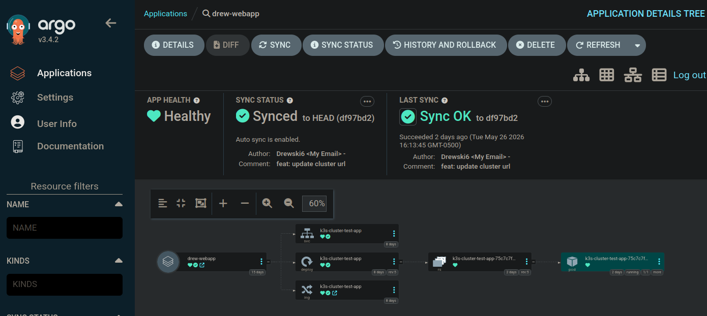

# Inception of Things

A local infrastructure project that uses Vagrant, k3s Kubernetes, k3d, and ArgoCD to build a small end-to-end deployment workflow on a personal machine.

This was completed as a two-person school project over about four months, from November 2025 to February 2026. Final result: 100/100, with no bonus section submitted.



## What This Project Does

The repository is split into three parts:

| Part | Goal | Main Tools |
| ---- | ---- | ---------- |
| `p1` | Build a two-node local Kubernetes cluster | Vagrant, libvirt/KVM, k3s |
| `p2` | Deploy multiple web apps behind Kubernetes ingress | Vagrant, k3s, Traefik |
| `p3` | Deploy an app through a GitOps workflow | Docker, k3d, kubectl, ArgoCD |

The overall idea is to simulate a small production-style platform locally: virtual machines provide the infrastructure, Kubernetes schedules the apps, Traefik routes HTTP traffic, and ArgoCD deploys application manifests from Git.

## Part 1: Local Kubernetes Cluster

`p1` creates two Debian Vagrant machines:

- `dpentlanS` at `192.168.56.110`, the k3s server node
- `dpentlanSW` at `192.168.56.111`, the k3s worker node

The server installs k3s first and generates the cluster join token. The worker then waits until that token is available over SSH and uses it to join the cluster automatically.

The challenging part here is not just "install Kubernetes." The hard part is making two local virtual machines behave like a real cluster. The config pins k3s and flannel networking to the private Vagrant interface, so Kubernetes does not accidentally advertise the NAT interface or an unreachable IP address.

Important files:

- `p1/Vagrantfile`
- `p1/scripts/bootstrap_server.sh`
- `p1/scripts/bootstrap_worker.sh`
- `p1/confs/k3s-config-server.yaml`
- `p1/confs/k3s-config-worker.yaml`

## Part 2: Apps and Ingress Routing

`p2` creates a single k3s VM and deploys three simple web apps using Kubernetes manifests. Each app has:

- a `Deployment` to run the container
- a `Service` to expose it inside the cluster
- an `Ingress` to route external HTTP traffic through Traefik

The first two apps use host-based routing:

- `app1.com` routes to App 1
- `app2.com` routes to App 2

The third app is configured as the default route when no specific host rule matches.

This part is usually tricky because the moving pieces are easy to confuse: a Deployment creates Pods, a Service selects Pods by label, and an Ingress points to the Service. If any label, port, namespace, or host rule is wrong, the app may be running perfectly but still be unreachable.

Important files:

- `p2/Vagrantfile`
- `p2/scripts/bootstrap.sh`
- `p2/confs/traefik-values.yaml`
- `p2/confs/k3s/*.yaml`

## Part 3: GitOps With ArgoCD

`p3` moves away from Vagrant-managed k3s and sets up a local k3d cluster, which runs Kubernetes inside Docker. The setup script installs:

- Docker
- k3d
- kubectl
- ArgoCD
- the ArgoCD CLI

ArgoCD is then used to deploy a basic app from Kubernetes manifests stored in a Git repository. Instead of manually applying YAML files with `kubectl apply`, ArgoCD watches the Git state and syncs the cluster to match it.

The app used for the subject is `wil42/playground`, deployed into the `dev` namespace and exposed on port `8888`.

Helper scripts are included to start and stop port forwarding:

- `p3/scripts/connect-argocd.sh` exposes the ArgoCD web UI on `localhost:8080`
- `p3/scripts/connect-app.sh` exposes the app on `localhost:8888`
- `p3/scripts/stop-argocd-port-forward.sh`
- `p3/scripts/stop-app-port-forward.sh`

The challenging part here is understanding the GitOps mental model: Git becomes the source of truth, ArgoCD becomes the deployer, and Kubernetes becomes the runtime. A small image tag change in Git, such as `v1` to `v2`, should be enough for ArgoCD to update the running application.

## Why This Project Was Interesting

This project combines several systems that are often taught separately:

- virtual machine provisioning with Vagrant
- Linux networking across multiple VM interfaces
- lightweight Kubernetes with k3s and k3d
- Kubernetes Deployments, Services, and Ingresses
- Traefik as an ingress controller
- ArgoCD as a GitOps deployment tool

The most difficult work was making the automation reliable. Local Kubernetes projects often fail because of small environment issues: nested virtualization, missing KVM support, incorrect VM network interfaces, TLS certificate SAN problems, mismatched Kubernetes labels, or port-forward processes left running in the background.

This repository documents and automates those details so the final result is repeatable instead of a one-time manual setup.

## Repository Layout

```text
.
├── p1/                  # Two-node k3s cluster with Vagrant
├── p2/                  # k3s app deployment and Traefik ingress
├── p3/scripts/          # k3d, ArgoCD, and port-forward helper scripts
├── setup_script.sh      # Early host setup notes
├── STEPS_I_TOOK.md      # Detailed personal build log
└── en.subject.pdf       # Original school subject
```

## Notes

This project was built for a school evaluation environment, so some values are intentionally specific: VM names, private IPs, hostnames, and the required `dev` namespace. The scripts are useful as a learning reference, but they may need small changes before running on another machine.
